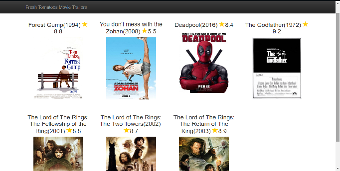

# Fresh Tomatoes
Fresh tomatoes lists my favorite movies with links to their Youtube  trailers.

## Quick Start
To get started, follow these instructions:

1. Run: `git clone git@github.com:de-laz/fresh-tomatoes.git` or Download Zip and extract to your local environment.
2. Inside the project folder, from the terminal, run `python entertainment_center.py`

After following the instructions, your browser should launch and you should see a page that looks like the following:


## What's included

The projects includes the following files:
```
fresh-tomatoes/
├── src/
│   ├── entertainment_center.py
│   ├── fresh_tomatoes.py
│   ├── media.py
├── .gitignore
└── .README.md
```